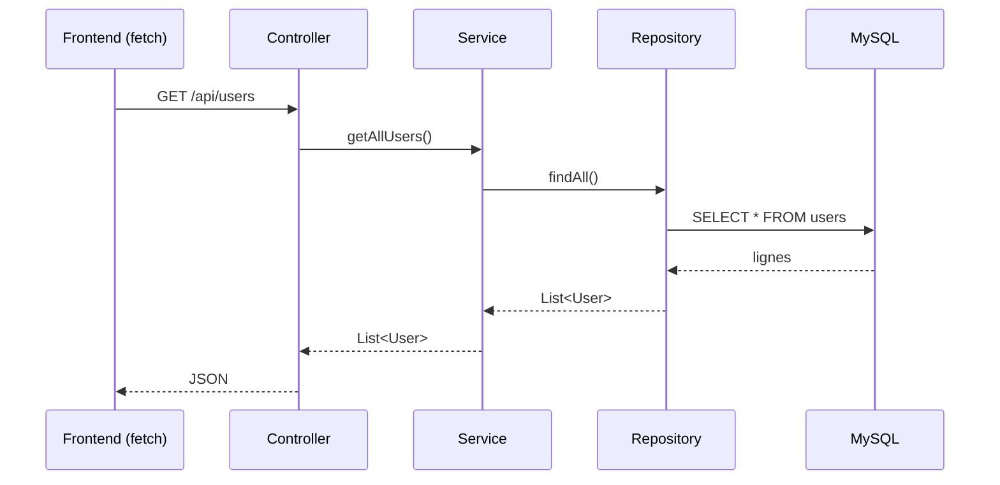
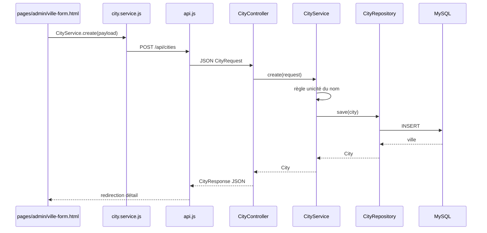

# Architecture du Projet "Atlas Voyage"

Ce document décrit l'architecture technique, la stack et le modèle de données de l'application web de l'agence de voyage "Atlas Voyage".

## Diagramme Général de l'Architecture

```mermaid
flowchart TD
    subgraph Client [Frontend (Navigateur)]
        UI[Pages HTML / CSS]
        JS[Logique Client - fetch API]
        UI <--> JS
    end

    subgraph Serveur [Backend (Spring Boot sur port 8080)]
        API[Controllers REST]
        Service[Services - logique métier]
        Repo[Repositories - accès aux données]
        Entity[Entities JPA]
        API --> Service
        Service --> Repo
        Repo -.->|manipule| Entity
    end

    subgraph Base de Données
        DB[(MySQL - port 3306)]
    end

    JS <-->|Requêtes HTTP JSON| API
    Repo <-->|JPA / Hibernate| DB
```

## 1. Stack Technologique

Le projet suit une architecture découplée (Frontend autonome communiquant avec une API REST Backend). Conformément au cahier des charges, aucun framework Frontend n'est utilisé.

**Frontend (Côté Client) :**
- **HTML5 & CSS3** : Sémantique, Responsive Design (Mobile First).
- **JavaScript (Vanilla)** : Manipulation du DOM, gestion du carrousel, filtres et requêtes API via `fetch()`.

**Backend (Côté Serveur) :**
- **Langage** : Java 21.
- **Framework** : Spring Boot 3.x.
- **Dépendances principales** :
  - *Spring Web* (Création des API REST).
  - *Spring Data JPA* (ORM pour interagir avec la base de données).
  - *Spring Boot Starter Mail* (Pour l'envoi d'emails de confirmation).
  - *Spring Security* (À venir pour sécuriser l'espace agent — pas encore ajouté au `pom.xml`).

**Base de données :**
- **SGBD** : MySQL (XAMPP en local). Les tables sont générées par Hibernate (`spring.jpa.hibernate.ddl-auto=update`).

---

## 2. Architecture Logicielle (Backend)

Le Backend Spring Boot est structuré en couches (Layered Architecture), sous le package racine `com.agence.voyage` :

| Package | Rôle | Annotation Spring |
|---|---|---|
| `controller` | Expose les endpoints REST, reçoit les requêtes HTTP, délègue au service. Aucune logique métier. | `@RestController` |
| `service` | Contient la logique métier (validation, règles, calculs). Seule couche qui appelle les repositories. | `@Service` |
| `repository` | Interfaces Spring Data JPA (`JpaRepository`) pour l'accès à la base. | (détecté automatiquement) |
| `entity` | Classes Java mappées sur les tables MySQL (et énumérations associées). | `@Entity` |
| `dto` | Objets de transfert pour les requêtes/réponses API (sans logique métier). | — |
| `exception` | Gestion centralisée des erreurs HTTP (`GlobalExceptionHandler`). | `@RestControllerAdvice` |
| `config` | Configuration transverse (CORS, données de démarrage). | `@Configuration`, `@Component` |

### Flux d'une requête : Controller → Service → Repository



Règle de dépendance : `Controller → Service → Repository → Entity`. Une couche ne connaît que celle située juste en dessous ; le Controller n'accède jamais directement au Repository.

### IoC et injection de dépendances

- Les classes annotées `@RestController`, `@Service`, `@Component` sont détectées au démarrage par le *component scan* de `@SpringBootApplication` et instanciées comme **beans** par le **conteneur Spring** (IoC : ce n'est plus le code qui fait `new`, c'est le conteneur).
- Les repositories sont des interfaces : Spring Data génère leur implémentation et l'enregistre comme bean.
- Les dépendances sont injectées **par constructeur** (champs `final`), par exemple :

```java
@RestController
@RequestMapping("/api/users")
public class UserController {
    private final UserService userService;

    public UserController(UserService userService) {   // injecté par Spring
        this.userService = userService;
    }
}
```

### État actuel de l'implémentation

| Composant | Classes |
|---|---|
| Controllers | `UserController`, `StatusController`, `CityController` |
| Services | `UserService`, `CityService` |
| Repositories | un par entité (`User`, `Offer`, `Bundle`, `Cart`, `CartItem`, `PromoCode`, `Booking`, `Payment`, `Notification`, `City`) |
| DTO | `CityRequest`, `CityResponse` |
| Config | `CorsConfig`, `DataSeeder` (comptes de test + villes de référence) |

### Séance 2 — Première fonctionnalité métier : **Villes**

**Objectif pédagogique :** architecture en couches, IoC, beans Spring, injection par constructeur, séparation présentation / métier.

**Flux complet (exemple création d'une ville) :**



**Endpoints `/api/cities` :**

| Méthode | Route | Rôle |
|---|---|---|
| GET | `/api/cities` | Liste |
| GET | `/api/cities/{id}` | Détail |
| POST | `/api/cities` | Création |
| PUT | `/api/cities/{id}` | Modification |
| DELETE | `/api/cities/{id}` | Suppression |

**Règles métier (couche `CityService` uniquement) :**
- Nom obligatoire et trim ;
- Unicité du nom (insensible à la casse) ;
- Ville introuvable → `404` ; conflit de nom → `400`.

---

## 2 bis. Architecture Frontend (Séance 2)

Le module **Villes** illustre la séparation des responsabilités côté client :

| Dossier / fichier | Rôle |
|---|---|
| `pages/admin/villes.html` | Page liste (HTML + chargement scripts) |
| `pages/admin/ville-form.html` | Formulaire ajout / modification |
| `pages/admin/ville-detail.html` | Page détail |
| `js/core/config.js` | Configuration (URL API) |
| `js/core/api.js` | Couche HTTP (`fetch`) — pas de logique métier |
| `js/services/city.service.js` | Appels API du domaine « Ville » |
| `js/pages/*.page.js` | Logique de présentation par page |
| `js/components/admin-layout.js` | Layout admin réutilisable |
| `css/pages/villes.css` | Styles du module Villes |

Le catalogue public (`js/app.js`) reste séparé : il ne contient pas la logique CRUD des villes.

**Espaces professionnels (maquettes intégrées) :**

| Espace | Entrée | Scripts | API branchée |
|---|---|---|---|
| Administration | `admin/index.html` | `admin/js/app.js`, `js/core/api.js` | Utilisateurs, Villes (liste/suppression) |
| Agent | `agent/index.html` | `agent/js/app.js`, `js/core/api.js` | Données démo (réservations, bundles, tickets…) |
| Fournisseur | `supplier/index.html` | `supplier/js/app.js`, `js/core/api.js` | Villes (select du wizard « Nouvelle offre ») |
| Client (SPA) | `client/index.html` | `client/js/app.js` | Données démo ; **accueil public** inchangé (`accueil.html`) |

Navigation interne : paramètre d’URL `?page=` (ex. `client/index.html?page=reservations`, `supplier/index.html?page=offers`). Offres, inventaire et réservations fournisseur restent en **données démo** jusqu’à l’API métier.

---

## 3. Modèle de Données (package `entity`)

Toutes les entités sont créées ; voir le cahier des charges (§6) pour le détail des champs.

- **`User`** : `id`, `fullName`, `email` (unique), `password`, `role`. Rôles (`Role`) : `CLIENT`, `SUPPLIER`, `AGENT`, `ADMIN`.
- **`Offer`** (classe abstraite, héritage `SINGLE_TABLE`, discriminant `offer_type`) : `title`, `description`, `basePrice`, `stock`, `allowsPayOnArrival`, `images`, `city`, `supplier`. Sous-classes : `Flight`, `Hotel`, `Car`, `TaxiTransfer`, `Excursion`.
- **`City`** : référentiel géographique (nom, latitude, longitude) ; une offre est rattachée à une ville.
- **`Bundle`** : offre composée de plusieurs offres, créée par un agent.
- **`Cart`** / **`CartItem`** : panier du client et ses lignes.
- **`PromoCode`** : code de réduction (`DiscountType`).
- **`Booking`** : réservation (`BookingStatus`).
- **`Payment`** : paiement (`PaymentMethod`, `PaymentStatus`).
- **`Notification`** : notifications in-app.

---

## 4. Communication Frontend <-> Backend

Le Frontend appelle l'API REST Spring Boot (port `8080`) avec `fetch()` ; le CORS est autorisé par `CorsConfig`. Le Frontend ne contient que la présentation et l'appel à l'API ; toute la logique métier reste dans les services du Backend.

**Endpoints existants :**
- `GET /api/status` : vérifie la connexion Frontend/Backend.
- `GET /api/users` : liste des utilisateurs (espace agent).
- `GET/POST/PUT/DELETE /api/cities` : gestion du référentiel villes (CRUD).

**Endpoints prévus :**
- `GET /api/offers` : offres du catalogue ; `GET /api/offers/search?city=Marrakech` : filtrage.
- `POST /api/bookings` : créer une réservation à partir du panier.
- `GET /api/admin/bookings` : réservations pour l'espace agent.
